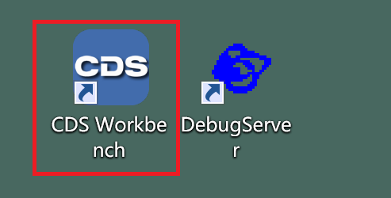

**基于 CDS 集成开发环境进行调试的说明**

<!-- TOC -->

- [1. 主机 Host 环境安装](#1-主机-host-环境安装)
- [2. 编译 bm4duo](#2-编译-bm4duo)
	- [2.1. 在 Windows 上下载 bm4duo](#21-在-windows-上下载-bm4duo)
	- [2.2. 下载 bm4duo 仓库](#22-下载-bm4duo-仓库)
	- [2.3. 用 CDS 打开 bm4duo](#23-用-cds-打开-bm4duo)
- [3. 调试步骤](#3-调试步骤)
	- [3.1. 将开发板和 Host 主机通过 CKLink 进行连接](#31-将开发板和-host-主机通过-cklink-进行连接)
	- [3.2. 烧写 SD 卡用于支持 JTAG 调试的引导程序](#32-烧写-sd-卡用于支持-jtag-调试的引导程序)
	- [3.3. 编译待调试版本](#33-编译待调试版本)
	- [3.4. 开发板上电](#34-开发板上电)
	- [3.5. 开始调试](#35-开始调试)

<!-- /TOC -->


**图 1：调试环境**

**注意：采用 CDS 集成开发环境后，上图的 Host 为一台运行 Windows 的物理机器，而我们安装的 CDS 集成开发环境包括了上图的 Debugger Server 和 GDB。**

# 1. 主机 Host 环境安装

即在 Windows 上安装 CDS 集成开发环境。

CDS 全称是 C-Sky Development Suite，即 C-SKY CPU & XuanTie CPU 嵌入式软件集成开发环境。

最新的版本可以通过如下路径找到：

登录 https://www.xrvm.cn/，"网页上的菜单项：技术支持 -> 资源下载 -> 开发工具 -> 集成开发环境：剑池 CDS。

截止本文编写，最新的是 “CDS集成开发环境V5.2.18”，下载最新的即可。

下载解压后如下图所示：


这里我们要安装的是 `cds-windows-mingw-elf_tools-V5.2.18-20240515-1758`。

继续解压后如下所示：


仔细阅读 "CDS 安装手册", 遵照手册说明安装即可。

安装好后桌面上会出现 CDS 的图标，如下图所示：



双击 CDS Workbench 即可打开 CDS。

有关 CDS 的使用请 **仔细** 阅读集成开发环境自带的使用说明手册。访问方法：菜单: Help -> Welcome，打开 Welcome 页面后点击 "User Guide" 即可。


# 2. 编译 bm4duo

## 2.1. 在 Windows 上下载 bm4duo

安装 Windows 版本的 git, 下载地址：<https://git-scm.com/download/win>。

## 2.2. 下载 bm4duo 仓库

和 Linux 上操作类似，git 安装好后，可以在 Git 自带的 bash shell 或者 Windows 自带的 Powershell 中执行 `git clone` 命令，将 bm4duo 下载到自己的工作空间目录中。假设这里 `$WS` 为 `D:\C-Sky\workspace-cds`。

```shell
$ cd $WS
$ git clone git@github.com:unicornx/bm4duo.git
```

## 2.3. 用 CDS 打开 bm4duo

打开 CDS 后，在菜单栏中点击 `"File -> Open Projects from File System..."`， 打开 `"import Projects from File System or Archive"` 对话框如下：


点击 `"Directory..."` 按钮选择上面下载的 bm4duo 路径，然后点击 `"Finish"` 即可。

导入完毕后的 CDS 界面如下：


# 3. 调试步骤

环境装好后，就可以准备调试了。

## 3.1. 将开发板和 Host 主机通过 CKLink 进行连接

参考 [《快速上手》][1] 一文中的第 4.1 章节 “硬件环境” 的方法将 SLogic Combo 8/CKLink 通过 USB 线连接到 Host 主机。

## 3.2. 烧写 SD 卡用于支持 JTAG 调试的引导程序

仓库中已经预先编译好了特殊的用于支持 JTAG 调试的 SD 卡引导程序，以 duo 256m 为例，文件为 bm4duo 下的 `prebuild/duo256/fip.bin`。

将这个版本生成的 `fip.bin` 烧写入 SD-card 的第一个 FAT32 分区，并插在 duo 开发板（即 **图 1** 中的 Target board）上。注意这个不是我们调试的版本，这个版本只是负责将开发板引导启动起来以便和 host 上的 XuanTie Debug Server 建立连接。

**注意：如果要反复修改和调试代码，sd 卡中的引导程序是不用改动的。**

## 3.3. 编译待调试版本

修改 `Makefile`，将 DEBUG 开关打开，打开后编译时会加上 `-g` 参数。


然后重新编译你要调试的版本，假设是 irq 测试用例。

因为我们要复用 bm4duo 项目的 `build.sh` 编译脚本，所以这里我们选择进入 C-Sky Console 手动进行编译：

点击 CDS 工具栏上的 `"C-Sky Console"` 按钮，如下所示：


打开 C-Sky Console 后，执行如下命令，首先进入 bm4duo 所在路径，其次运行 CDS 安装的 bash 工具，进入 bash 命令行界面后执行运行 build 命令，重新编译你要调试的版本，假设要调试的版本是 irq 测试用例。


## 3.4. 开发板上电

SD 卡引导程序插入 SD 卡槽，开发板 duo256 上电。此时观察开发板，板载 LED 蓝灯常亮。

如果连接了串口，观察控制台上显示：

```
====> In DEBUG mode ......
```

## 3.5. 开始调试

首先设置断点，有关如何在 CDS 环境中设置断点，可自行参阅 CDS 的 "User Guide"。

然后就可以进行调试了，点击工具栏上的 `"Launch"` 按钮如下图所示。


如果要修改程序，重新调试，可以如下图所示点击 `"Stop"` 按钮退出 Debug mode，


然后重复以下步骤即可：

- [3.3. 编译待调试版本](#33-编译待调试版本)
- [3.4. 开发板上电](#34-开发板上电)
- [3.5. 开始调试](#35-开始调试)

**TIPS：**

- 如果发现 DebugServer 连接 Target board 失败，可以插拔 CKLink 连接线进行重试。
- 如果发现 开发板启动失败，可以插拔 SD 卡进行重试。


[1]:./quick_guide.md


