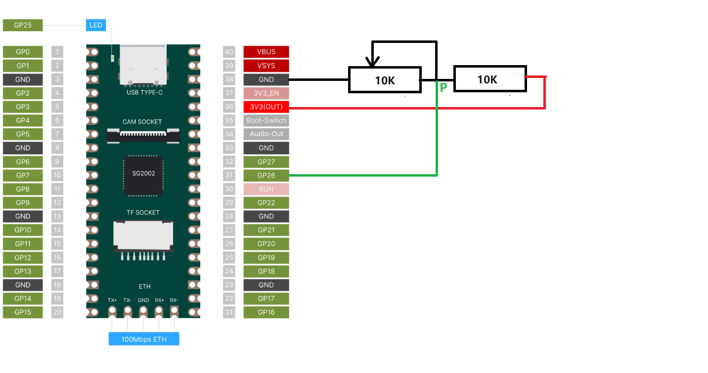
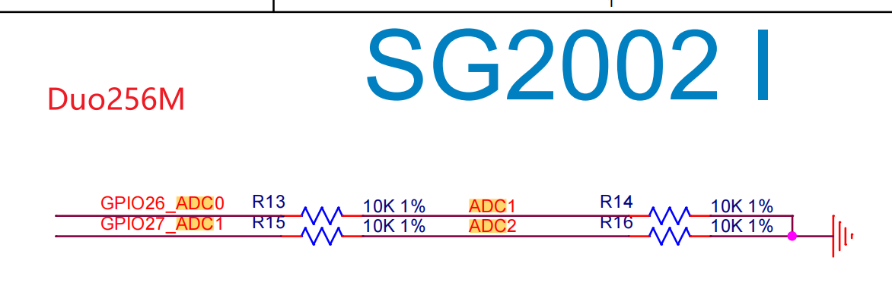

ADC 采样电压电路连接示意图

注意，由于 SoC 芯片的 ADC 在采样时仅支持不超过 1.8v 的电压输入，所以 Duo 和 Duo256 使用两个 10K 欧姆的电阻将模拟输入从 3.3V 分压到 1.65V。如下图所示，所以在使用 ADC 功能时，一定到考虑分压对输入信号的影响。

具体来说，上图中 ADC1/ADC2 是连接 SoC 芯片的 ADC 输入引脚，GPIO16_ADC0/GPIO27_ADC1 是对应开发板级别的输入引脚。所以假设我们在开发板引脚上输入的电压是 V 时（譬如 ADC 采样电压电路连接示意图中 P 点），实际 SoC 引脚上得到的输入电压只有其一半，这才是我们实际测量得到的电压值。

顺便说一下：Duo 和 Duo 256 都存在以上问题，而 Duo S 不存在分压电路，SoC 引脚是直接接到排针引脚的。

