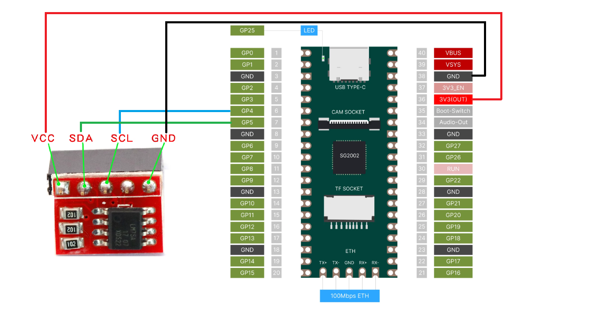
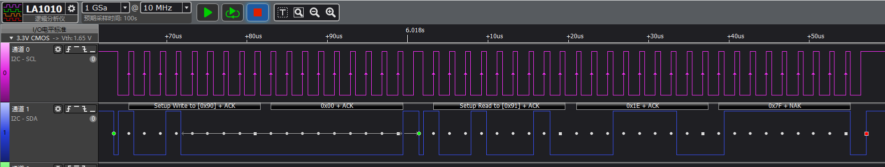

I2C LM75A 温度传感器电路连接示意图



LM75A 的 datasheet 参考 [这里](../lm75a.pdf)

重点看一下 FUNCTIONAL DESCRIPTION 章节的以下内容：
- I2C Serial Interface
- Pointer register
- Temperature register（Temp）
- Protocols for writing and reading the registers


执行 i2c 测试后用逻辑分析仪抓总线波形如下：



对应串口上打印信息：

```shell
====> test start
====> Running I2C example ......
rx fifo not ready!
---> read data 0x1e, 0x7f
LM75: temperature is 30.38c
```

I2C 波形简单分析，分为以下九个阶段：

- `IDLE`

  当总线空闲时，SDA 和 SCL 都处于高电平状态。

- `Start`

  起始信号（图上第一个绿色点）。为了标识传输正式启动，master 设备发起 Start 信号，master 将 SCL 保持为高电平，然后将 SDA 拉低，这样，所有 slave 设备就会知道传输即将开始。

- `"Setup Write to (0x90) + ACK"`

  master 发送地址帧（address frame），一个 7-bit 的地址是从最高位（MSB）开始发送的，这个地址后面会紧跟 1-bit 的操作符，1 表示读操作，0 表示写操作。这里波形显示（ SCL 高电平采样）依次发送电平值为 0x90（二进制 b10010000），即地址 0x48（b1001000）加上最后一个 0 表示发起的是写操作。

  接下来的一个 bit 是 NACK/ACK，当这个帧中前面 8bits 发送完后，接收端的 slave 设备获得 SDA 控制权，此时 slave 设备应该在第 9 个时钟脉冲之前回复一个 ACK（将 SDA 拉低）以表示接收正常，如果接收设备没有将 SDA 拉低，则说明接收设备可能没有收到数据（如寻址的设备不存在或设备忙）或无法解析收到的消息，如果是这样，则由 master 来决定如何处理（stop 或 repeated start condition）。

- `"0x00 + ACK"`

  slave 使时钟线 SCL 保持低电平，迫使 master 进入等待状态。

- `Start/Restart`

  起始信号（图上第二个绿色点）。slave 释放 SCL，SCL 恢复为高电平，master 将 SDA 拉低, 表示第二次 Start 开始。这里也称为 Restart。

- `"Setup Read to (0x91) + ACK"`

  接着 master 发送地址帧（address frame），这里波形显示依次发送电平值为 0x91（二进制 b10010001），即地址 0x48（b1001000）加上最后一个 1 表示发起读操作。

  接下来的一个 bit 是 ACK，slave 表示正常收到。

- `"0x1E + ACK"`

  slave 发送给 master 的第一个字节数据。master 回复 ACK 表示收到。

- `"0x7F + NACK"`

  slave 发送给 master 的第二个字节数据。master 回复 NACK（当第 9 个 SCL 时钟周期时，SDA 保持高电平，表示非应答信号，即 NACK）。master 接收 slave 数据时，master 产生 NACK，通知 slave 数据传输结束，不要再发数据了 表示停止接受。

- `Stop` 停止信号（图上红色点）

  master 发起传输停止。停止条件定义为：SCL处于高电平，SDA 发生由低到高变化。
