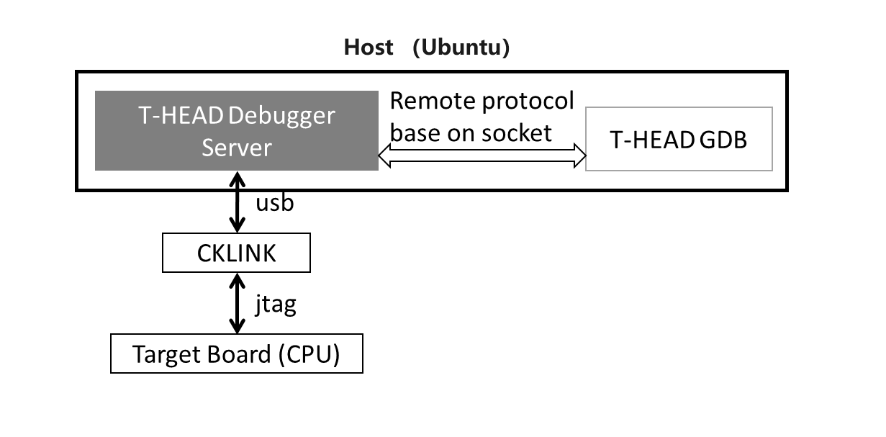
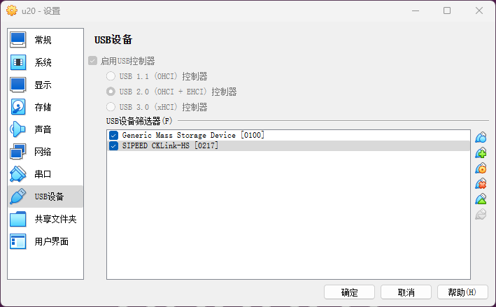

**快速上手**

<!-- TOC -->

- [1. 搭建环境](#1-搭建环境)
- [2. 构建](#2-构建)
- [3. 烧录和测试](#3-烧录和测试)
- [4. Jtag + GDB 调试](#4-jtag--gdb-调试)
	- [4.1. 硬件环境](#41-硬件环境)
	- [4.2. 软件环境](#42-软件环境)
		- [4.2.1. 安装 XuanTie Debug Server](#421-安装-xuantie-debug-server)
	- [4.3. 调试步骤](#43-调试步骤)
		- [4.3.1. 将开发板和 Host 主机通过 CKLink 进行连接](#431-将开发板和-host-主机通过-cklink-进行连接)
		- [4.3.2. 编译 SD 卡引导程序](#432-编译-sd-卡引导程序)
		- [4.3.3. 编译待调试版本](#433-编译待调试版本)
		- [4.3.4. 开发板上电](#434-开发板上电)
		- [4.3.5. 启动 DebugServer，连接 Target board](#435-启动-debugserver连接-target-board)
		- [4.3.6. 启动 GDB](#436-启动-gdb)

<!-- /TOC -->

# 1. 搭建环境

我们的开发 host 机为 x86_64，推荐采用 Ubuntu 20 或者以上版本系统。

```shell
$ lsb_release -a
No LSB modules are available.
Distributor ID:	Ubuntu
Description:	Ubuntu 20.04.6 LTS
Release:	20.04
Codename:	focal
```

**注意**：如果希望采用 Jtag + gdb 进行调试的话，推荐在 Windows 上运行，比较稳定。此时，我们可以在 Windows 上安装 VirtualBox, 然后在 VirtualBox 中安装 Ubuntu。

APT 安装一些依赖的工具
```shell
$ sudo apt update
$ sudo apt install git build-essential python3
```

下载本仓库，假设你的工作路径为 `$WS`, 且下载本仓库的路径为 `$WS/bm4duo`。

```shell
$ cd $WS
$ git clone git@github.com:unicornx/bm4duo.git
```

下载 Sophgo 提供的编译工具链，假设下载后的路径为 `$WS/host-tools`。

```shell
$ cd $WS
$ git clone git@github.com:sophgo/host-tools.git
```

记得修改 `$WS/bm4duo/Makefile` 中的 `TOOL_PATH`，确保其指向下载的 Sophgo 编译工具链。因为我们采用交叉构建方式编译，所以选择针对 RISC-V 裸机交叉开发的 GCC：riscv64-elf-x86_64, 举例如下。

```makefile
TOOL_PATH :=  $WS/host-tools/gcc/riscv64-elf-x86_64/bin
```

新版本的 `$WS/bm4duo/Makefile` 中的 `TOOL_PATH` 默认值已经改为 `/opt/bm4duo-toolchain`。所以为了尽量不修改原始仓库代码，我们也可以在系统中建立一个 `/opt/bm4duo-toolchain` 的符号链接，将其指向 `$WS/host-tools/gcc/riscv64-elf-x86_64/bin`。

```shell
$ sudo ln -s $WS/host-tools/gcc/riscv64-elf-x86_64/bin /opt/bm4duo-toolchain
```

**记得将以上路径中的 `$WS` 替换为您本机的实际工作路径**。


# 2. 构建

进入 `$WS/bm4duo`，执行 `build.sh` 脚本，注意该文件是一个符号链接，实际执行的文件是 bm4duo 仓库下的 `./scripts/build.sh`。

直接运行 `build.sh` 会打印简单的使用帮助，该脚本比较简单，感兴趣也可以直接阅读脚本内容了解功能：

```shell
$ ./build.sh 
Usage: [BOARD=board] build.sh '-h'|'-a'|<case>
  board: duo/duo256, default is duo256
  -h: print this usage
  -a: try to build all cases, just used for integrity test and no output created
  <case>: build <case>, <case> can be: gpio uart pwm rtc rtc_irq wdt adc i2c timer spi dbg
```

需要注意的是：

- 本仓库支持多个 duo 产品，默认构建 duo256 的程序，如果要切换到其他产品，譬如 duo，可以利用环境变量 `BOARD` 进行指定。
- `-a` 仅用于完整性构建测试，即批处理一次性构建所有的用例。
- 正常情况下，一次构建只针对一个用例。譬如我们要构建针对 duo256 的 gpio 这个测试用例，可以输入：
  ```shell
  ./build.sh gpio
  ```

构建完成后生成的程序文件在 bm4duo 仓库下的 `release_out` 目录下，文件名称为 `fip.bin`

# 3. 烧录和测试

生成 `fip.bin` 文件后可以将其写入 sd-card 的第一个分区中，然后将 sd-card 插入 duo 开发板的 micro-sd 卡槽中，上电即可工作。可以连接串口观察程序输出。

为方便在 Linux 环境下烧写 sd-card，bm4duo 仓库根目录下提供了一个 mkcard.sh 的脚本，如果您使用的是市面上常用的 USB 接口的 sdcard 读写器，可以直接运行该脚本将生成的 fip.bin 文件 写入 sd-card 的第一个分区。该脚本也是一个符号链接，实际执行的文件是 bm4duo 仓库下的 `./scripts/flash_sdcard.sh`。使用该脚本时有以下几点注意一下：

- 该脚本默认您的读卡器连上 Linux 主机后枚举的设备文件名为 `/dev/sdb1`。如果你的设备枚举名称不同，可以在执行脚本时通过环境变量 `DEV` 自行指定。譬如 `DEV=/dev/sdc1 ./mkcard.sh`。
- 该脚本将 `DEV` 设备挂载到默认的挂载点 `UDISK`, 如果您使用不同的挂载点路径，可以直接修改 `mkcard.sh` 脚本中的环境变量 `UDISK`, 或者和 `DEV` 类似在执行脚本命令时指定。譬如 `UDISK=/mnt/u-disk ./mkcard.sh`
- 执行该脚本需要 sudo 权限。

有关 sd-card 的制作可以参考[《将 RVOS 移植到 MilkV-Duo 上》][1] 的 “sd-card 启动盘的制作” 章节介绍。

有关开发板接串口可以参考[《将 RVOS 移植到 MilkV-Duo 上》][1] 的 “其他注意事项：串口连接和设置” 章节介绍。

# 4. Jtag + GDB 调试

## 4.1. 硬件环境

调试时，我们需要将调试主机和开发板之间通过特殊的 CKLINK 进行连接，连接示意图如下，具体可以参考 [T-Head DebugServer 用户手册][2]。



**图 1：调试环境**

**注意** 目前我们发现由于 Duo 开发板的限制，采用平头哥默认的官方 CKLink 反而连接不上，但是我们发现可以采用 Sipeed 开发的一款 四合一功能的设备 SLogic Combo 8 进行连接。具体有关产品的介绍可以访问 [SLogic Combo 8 的官网][3]。具体购买可以上淘宝。


**图 2：SLogic Combo 8**

SLogic Combo 8 是一款兼有逻辑分析仪、CKLink Debugger、DAP-Link Debugger、USB2UART 功能的开发工具。我们这里只用到 CKLink Debugger 的功能。

## 4.2. 软件环境

如前文所述，如果希望采用 Jtag + gdb 进行调试的话，推荐在 Windows 上运行，比较稳定。此时，我们可以在 Windows 上安装 VirtualBox, 然后在 VirtualBox 中安装 Ubuntu。

首先安装 VirtualBox 并在 VirtualBox 中安装 Ubuntu，这里不再赘述，自行搜索安装方法（**唯一值得提醒的是记得安装 Virtualbox 的 Extension Pack，否则后面 USB 识别会有问题**）。然后按照 [1. 搭建环境](#1-搭建环境) 的方法将仓库代码和工具链安装好，注意工具链中已经包含了我们要使用的 gdb。

### 4.2.1. 安装 XuanTie Debug Server

下载地址：<https://www.xrvm.cn/community/download?id=4313368247333359616>， 我这里使用的是 `XuanTie-DebugServer-linux-x86_64-V5.18.1-20240513.sh.tar.gz`，即安装在 Linux 上的 x86_64 的版本。

最新的版本可以通过如下路径找到：

登录 <https://www.xrvm.cn/>，"网页上的菜单项：技术支持 -> 资源下载 -> 开发工具 -> 调试工具&模拟器 -> XuanTie Debug Server"。

假设下载到 Ubuntu 的 `$JTAG` 路径下。

```shell
$ cd $JTAG
$ tar xzf XuanTie-DebugServer-linux-x86_64-V5.18.1-20240513.sh.tar.gz
$ sudo ./XuanTie-DebugServer-linux-x86_64-V5.18.1-20240513.sh -i
```

安装过程中会提示输入安装的路径，可以自己选择一个，如果默认会安装到 `/usr/bin/XUANTIE_DebugServer`。

这样 Host 上的软件环境就装好了，包括 XuanTie Debug Server 和 gdb 两个工具，参考 **图 1**。

## 4.3. 调试步骤

环境装好后，就可以准备调试了。

### 4.3.1. 将开发板和 Host 主机通过 CKLink 进行连接

具体参考 [SLogic Combo 8 作为 CKLink 使用说明][4]。

按下切换按键，确保指示灯切换为黄色。

以 duo 256 为例，具体连线时，参考 [duo 256 引脚图][5]。将 CKLink 的 GND/TCK/TDI/TDO/TMS 和 duo 256 的 GND(3)/GP3(5)/GP0(1)/GP1(2)/GP2(4) 分别相连。

```
CKlink        Duo256M
  GND <------> GND(3)
  TCK <------> GP3(5)
  TDI <------> GP0(1)
  TDO <------> GP1(2)
  TMS <------> GP2(4)
```

此时可以将 SLogic Combo 8/CKLink 通过 USB 线连接到 Host 主机。**注意如果 host 是运行在 Windows 上 Virtualbox 中（这也是我们目前推荐的方式），需要将 Windows 下识别的 CKlink 设备 pick 到 Virtualbox 中的 Ubuntu host 中**，至于如何让 Virtualbox 中的 Ubuntu 识别 Windows 上的 USB 设备，可以参考这篇 [《virtualbox虚拟机挂载USB设备》][7]。

在这里，我们需要在 Virtualbox 的 USB 设备筛选器中添加的是一个叫做 "SIPEED CKLink-HS" 的设备。



**图 2：Virtualbox 中设置 USB 自动识别 Sipeed CKLink 设备**

如果识别成功，我们在 Ubuntu 中执行 dmesg 应该会看到如下提示：

```shell
$ dmesg
[17533.313568] usb 1-1: new high-speed USB device number 5 using ehci-pci
[17533.693871] usb 1-1: config 1 interface 0 altsetting 0 bulk endpoint 0x2 has invalid maxpacket 64
[17533.693894] usb 1-1: config 1 interface 0 altsetting 0 bulk endpoint 0x81 has invalid maxpacket 64
[17533.693905] usb 1-1: config 1 interface 1 altsetting 0 endpoint 0x85 has an invalid bInterval 0, changing to 7
[17533.706581] usb 1-1: New USB device found, idVendor=42bf, idProduct=b210, bcdDevice= 2.17
[17533.706600] usb 1-1: New USB device strings: Mfr=1, Product=2, SerialNumber=3
[17533.706609] usb 1-1: Product: CKLink-HS       
[17533.706617] usb 1-1: Manufacturer: SIPEED  
[17533.706624] usb 1-1: SerialNumber: FactoryAIOT
[17533.723432] cdc_acm 1-1:1.1: ttyACM0: USB ACM device
```

### 4.3.2. 编译 SD 卡引导程序

```shell
$ cd $WS/bm4duo
$ ./build.sh dbg
```

将这个版本生成的 `fip.bin` 烧写入 SD-card，并插在 duo 开发板（即 **图 1** 中的 Target board）上。注意这个不是我们调试的版本，这个版本只是负责将开发板引导启动起来以便和 host 上的 XuanTie Debug Server 建立连接。

**注意：如果要反复修改和调试代码，sd 卡中的引导程序是不用改动的。**

### 4.3.3. 编译待调试版本

```shell
$ cd $WS/bm4duo
```

修改 `Makefile`，将 DEBUG 开关打开，打开后编译时会加上 `-g` 参数。

```makefile
# set this to 1 for debug version
# default debug is disabled
DEBUG := 1
```

然后重新编译你要调试的版本，假设是 irq 测试用例。

```shell
$ ./build.sh irq
```

### 4.3.4. 开发板上电

SD 卡引导程序插入 SD 卡槽，开发板 duo256 上电。此时观察开发板，板载 LED 蓝灯常亮。

如果连接了串口，观察控制台上显示：

```
====> In DEBUG mode ......
```

### 4.3.5. 启动 DebugServer，连接 Target board

```shell
$ cd $JTAG
$ sudo DebugServerConsole 
+---                                                    ---+
|  XuanTie Debugger Server (Build: May 13 2024, Linux)      |
   User   Layer Version : 5.18.01 
   Target Layer version : 2.0
|  Copyright (C) 2024 Hangzhou C-SKY MicroSystems Co., Ltd.|
+---                                                    ---+
XuanTie: CKLink_Lite_V2, App_ver unknown, Bit_ver null, Clock 2526.316KHz,
       5-wire, With DDC, Cache Flush On, SN CKLink_Lite_Vendor-FactoryAIOT.
+--  Debug Arch is RVDM.  --+
+--  CPU 0  --+
RISCV CPU Info:
	WORD[0]: 0x0910090d
	WORD[1]: 0x12046000
	WORD[2]: 0x260c0001
	WORD[3]: 0x30030076
	WORD[4]: 0x42180000
	WORD[5]: 0x50000000
	WORD[6]: 0x60000853
	MISA   : 0x8000000000b4112d
	MHARTID: 0x0
Target Chip Info:
	CPU Type is C906FDV, Endian=Little, Vlen=128, Version is R2S1P6.
	DCache size is 64K, 4-Way Set Associative, Line Size is 64Bytes, with no ECC.
	ICache size is 32K, 2-Way Set Associative, Line Size is 64Bytes, with no ECC.
	Current cluster0 has 1 core.
	MMU has 256 JTLB items.
	PMP zone num is 8.
	HWBKPT number is 4, HWWP number is 4.
	MISA: (RV64IMAFDCVX, Imp M-mode, S-mode, U-mode)
+--  CPU 1  --+
RISCV CPU Info:
	WORD[0]: 0x0910010d
	WORD[1]: 0x12046000
	WORD[2]: 0x260c0001
	WORD[3]: 0x30030054
	WORD[4]: 0x42180000
	WORD[5]: 0x50000000
	WORD[6]: 0x60000753
	MISA   : 0x800000000094112d
	MHARTID: 0x0
Target Chip Info:
	CPU Type is C906FD, Endian=Little, Version is R2S1P6.
	DCache size is 16K, 4-Way Set Associative, Line Size is 64Bytes, with no ECC.
	ICache size is 8K, 2-Way Set Associative, Line Size is 64Bytes, with no ECC.
	Current cluster1 has 1 core.
	MMU has 128 JTLB items.
	PMP zone num is 8.
	HWBKPT number is 4, HWWP number is 4.
	MISA: (RV64IMAFDCX, Imp M-mode, S-mode, U-mode)

GDB connection command for CPUs(CPU0):
	target remote 127.0.0.1:1025
	target remote 192.168.2.116:1025

GDB connection command for CPUs(CPU1):
	target remote 127.0.0.1:1026
	target remote 192.168.2.116:1026

****************  DebuggerServer Commands List **************
help/h
	Show help informations.
*************************************************************
DebuggerServer$ Get connection from 127.0.0.1 for CPU 0, at 2024-07-02 16:51:14
Connection to CPU 0 is lost, at 2024-07-02 17:12:46

DebuggerServer$ 
```

从控制台输出可以知道，对于大核 CPU0，我们可以在 gdb 中通过 1025 端口进行连接。

### 4.3.6. 启动 GDB

另外开一个控制台，执行如下命令

```shell
$ cd $WS/bm4duo
$ $WS/host-tools/gcc/riscv64-elf-x86_64/bin/riscv64-unknown-elf-gdb ./out/bm_duo256.elf
GNU gdb (V2.0.3.0-xialf) 8.2.50.20190202-git
Copyright (C) 2019 Free Software Foundation, Inc.
License GPLv3+: GNU GPL version 3 or later <http://gnu.org/licenses/gpl.html>
This is free software: you are free to change and redistribute it.
There is NO WARRANTY, to the extent permitted by law.
Type "show copying" and "show warranty" for details.
This GDB was configured as "--host=x86_64-pc-linux-gnu --target=riscv64-unknown-elf".
Type "show configuration" for configuration details.
For bug reporting instructions, please see:
<http://www.gnu.org/software/gdb/bugs/>.
Find the GDB manual and other documentation resources online at:
    <http://www.gnu.org/software/gdb/documentation/>.

For help, type "help".
Type "apropos word" to search for commands related to "word"...
Reading symbols from ./out/bm_duo256.elf...
(gdb)
```

在 Ubuntu 22 以上版本中可能会遇到 `error while loading shared libraries: libncursesw.so.5: cannot open shared object file` 的错误。这是由于我们使用的 Xuantie 的工具链版本依赖的动态库版本和 Ubuntu 22 上默认安装的高版本动态库比起来太低导致，解决方法，可以参考 [这篇网文][6]。

进入 gdb 后先执行如下命令连上 XuanTie Debug Server。

```shell
(gdb) target remote : 1025
Remote debugging using : 1025
0x000000008000c4a0 in main () at /home/u/ws/duo/bm4duo/source/main.c:23
23		printf("====> test done!\n");
```

此时查看 pc，是一个当前 Target board 上运行值，也即我们 sd card 上 SD 卡引导程序运行的 pc 值。

```shell
(gdb) p $pc
$1 = (void (*)()) 0x8000c4a0 <main+32>
```

这时候我们可以输入 `load` 命令，将我们在执行 gdb 命令时指定的 `./out/bm_duo256.elf` 重新加载到内存中，gdb 会根据 elf 文件中指定的加载的地址记载，也就是我们编译链接时指定的链接地址 0x8000000。

```shell
(gdb) load
Loading section .text, size 0xd778 lma 0x80000000
        section progress: 100.0%, total progress: 85.77% 
Loading section .rodata, size 0x1178 lma 0x8000d780
        section progress: 100.0%, total progress: 92.72% 
Loading section .data, size 0x1248 lma 0x8000e8f8
        section progress: 100.0%, total progress: 100.00% 
Start address 0x80000000, load size 64312
Transfer rate: 68 KB/sec, 3572 bytes/write.
(gdb) p $pc
$2 = (void (*)()) 0x80000000 <entry_vector>
```

此时我们就可以执行 gdb 的命令进行调试了。简单演示如下。从 `entry_vector` 开始，我们可以执行 si 单步汇编，也可以设置断点（b）、继续运行（c）、执行单个函数（n）、执行单条 c 语句（s）等常规操作。

```shell
(gdb) si
6		li x1, 0
(gdb) 
7		li x2, 0
(gdb) b main
Breakpoint 1 at 0x8000c488: file /home/u/ws/duo/bm4duo/source/main.c, line 19.
(gdb) c
Continuing.

Breakpoint 1, main () at /home/u/ws/duo/bm4duo/source/main.c:19
19		printf("====> test start\n");
(gdb) n
21		testcase_main();
(gdb) s
testcase_main () at /home/u/ws/duo/bm4duo/source/test/test_main.c:18
18		printf("====> Running IRQ example ......\n");
(gdb) 
```

如果要修改程序，重新调试，可以退出 gdb 和 DebugServer，然后重复以下步骤即可：

- [4.3.3. 编译待调试版本](#433-编译待调试版本)
- [4.3.4. 开发板上电](#434-开发板上电)
- [4.3.5. 启动 DebugServer，连接 Target board](#435-启动-debugserver连接-target-board)
- [4.3.6. 启动 GDB](#436-启动-gdb)

**TIPS：如果发现 DebugServer 连接 Target board 失败，可以插拔 CKLink 连接线进行重试。**

[1]:https://zhuanlan.zhihu.com/p/691697875
[2]:https://www.xrvm.cn/document?temp=introduction-2&slug=t-head-debug-server-user-manual
[3]:https://wiki.sipeed.com/hardware/zh/logic_analyzer/combo8/index.html
[4]:https://wiki.sipeed.com/hardware/zh/logic_analyzer/combo8/use_cklink_function.html
[5]:https://milkv.io/docs/duo/getting-started/duo256m#gpio-pinout
[6]:https://blog.csdn.net/winter99/article/details/117464598
[7]:https://blog.csdn.net/qq_38420206/article/details/120780572
